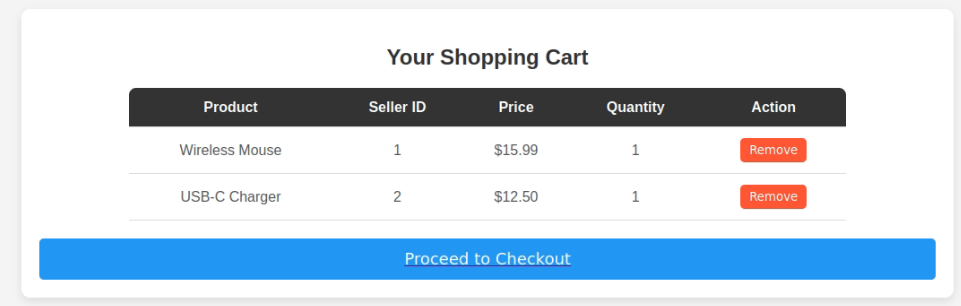

## 📁 **Repository Structure (Flat Layout)**

```
online-marketplace/
│
├── add_to_cart.php
├── checkout.php
├── index.php
├── login.php
├── logout.php
├── market.sql                  # Full schema and sample data
├── navbar.php
├── process_payment.php
├── profile.php
├── remove_from_cart.php
├── sell_product.php
├── sign_up.php
├── view_cart.php
├── README.md                   # Project guide
```

---

## 📘 **README.md (Flat File Version)**

```markdown
# 🛒 Online Marketplace

A simple PHP & MySQL-based online marketplace for buying and selling products. Users can manage their balance, view their cart, and track transactions.

---

## 🚀 Features

- User authentication (sign up/login/logout)
- Add products (sellers)
- Add to cart and checkout (buyers)
- Balance tracking
- Transaction records

---

## 🛠️ Installation Instructions

1. **Clone the repository:**
   ```bash
   git clone https://github.com/Suthfan/Market.git
   cd online-marketplace
   ```

2. **Import the database**
   - Open **phpMyAdmin** or MySQL CLI.
   - Import `market.sql` to create the database and sample data:
     ```sql
     SOURCE path/to/market.sql;
     ```

3. **Set up server:**
   - Use **XAMPP**, **LAMP**, or **WAMP**.
   - Place all files into `htdocs/online-marketplace/` (for XAMPP).
   - Visit in browser:
     ```
     http://localhost/online-marketplace/index.php
     ```

---

## 📂 File Overview

| File                  | Description                           |
|-----------------------|---------------------------------------|
| `index.php`           | Homepage listing products             |
| `login.php`           | Login form                            |
| `sign_up.php`         | Sign up / registration form           |
| `logout.php`          | Logout logic                          |
| `sell_product.php`    | Sell product page                     |
| `profile.php`         | User profile with balance info        |
| `add_to_cart.php`     | Backend logic to add to cart          |
| `remove_from_cart.php`| Remove items from cart                |
| `view_cart.php`       | View and manage items in cart         |
| `checkout.php`        | Checkout and confirm purchase         |
| `process_payment.php` | Handle balance transfer and logging   |
| `navbar.php`          | Shared navigation bar across pages    |
| `market.sql`          | SQL script (schema + sample data)     |

---

## 🧪 Testing Instructions

1. **Register users**:
   - Sign up as a seller and a buyer.
2. **Sell a product**:
   - Log in as seller, go to `sell_product.php` and add a product.
3. **Add to cart**:
   - Log in as a buyer and add the product from `index.php`.
4. **View and checkout**:
   - Visit `view_cart.php` → Checkout → Balance updates.
5. **Check balances and transactions**:
   - Buyer’s balance decreases, seller’s balance increases.

---

## 🖼️ Screenshots

### 🔹 Homepage


### 🔹 Login Page


### 🔹 Signup Page


### 🔹 Sell Product Page


### 🔹 View Cart


### 🔹 Checkout Page


### 🔹 Profile Page


### 🔹 Payment Success Page


```
